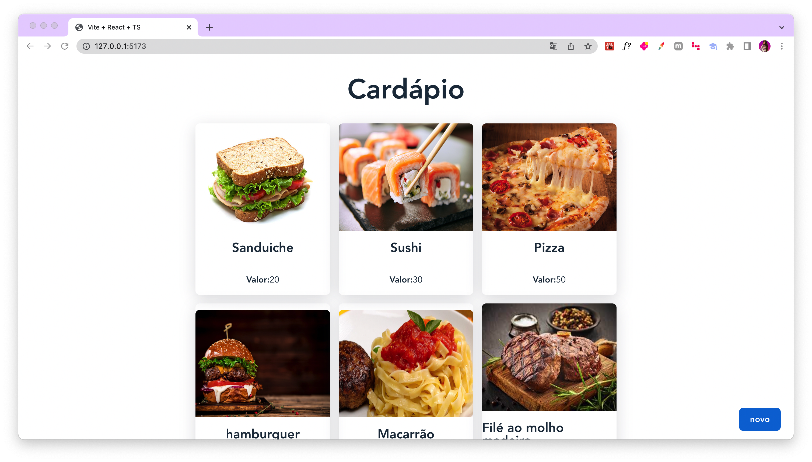
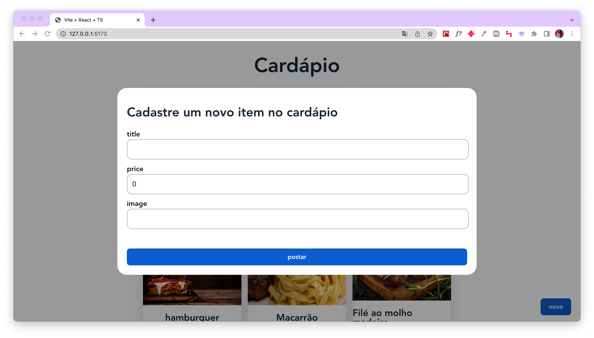

# Cardápio Digital - Aplicação Frontend

Este projeto é um simples simples protótipo de um Cardápio Digital desenvolvido durante meu [tutorial no YouTube](https://www.youtube.com/@kipperdev). A aplicação foi desenvolvida usando **React, Typescript e React Query**.

<h1 align="center">
    
    
</h1>

## 💻 Requisitos

Antes de iniciar, você deve ter o Node.js e o NPM instalados em sua máquina.

## 🚀 Instalando

Primeiro, você deve clonar o projeto na sua máquina, para isso você
pode colar o seguinte comando em seu terminal

```bash
git clone https://github.com/Fernanda-Kipper/frontend-cardapio.git
cd frontend-cardapio
```

Para instalar as dependências, execute o seguinte comando:

```bash
npm install
```

Por fim, para executar o projeto basta rodar o seguinte:

```bash
npm run dev
```

## 🔧 Compilação

Para compilar a aplicação para produção, execute o seguinte comando:

```bash
npm run build
```
Isso irá gerar uma versão otimizada da aplicação na pasta `dist`.

## 🫂 Integração com Backend

Para realizar a integração com o Backend, você pode clonar o projeto e rodar localmente, ou desenvolver você mesmo seguindo o tutorial no Youtube.

👉 [Desenvolvendo o Backend com Java Spring](https://www.youtube.com/watch?v=lUVureR5GqI&t=239s)

👉 [Link do repositório](https://github.com/Fernanda-Kipper/backend-cardapio-digital)

## Minhas Redes

Meu site: [fernandakipper.com](https://www.fernandakipper.com) &nbsp;&middot;&nbsp; 

Instagram: [@kipper.dev](https://github.com/kipper.devb) &nbsp;&middot;&nbsp;

YouTube [@kipperdev](https://www.youtube.com/@kipperdev) &nbsp;&middot;&nbsp;


## 📝 Licença

Este projeto está licenciado sob a licença MIT. Consulte o arquivo `LICENSE` para obter mais informações.